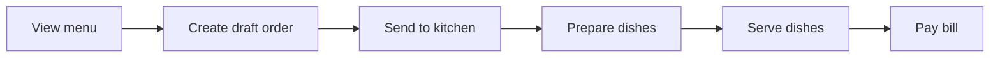
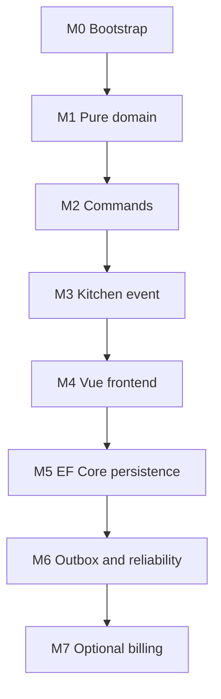

# แผนทำ DDD Restaurant Handbook และ Reference Implementation

## 1. เป้าหมาย

สร้าง handbook ภาษาไทยสำหรับให้ SA และ developer เรียนรู้การออกแบบ Domain-Driven Design (DDD) จากกรณีศึกษา Restaurant เดียวกันตั้งแต่ business flow ไปจนถึง reference implementation ที่รันและทดสอบได้จริง

ผู้เรียนควรทำได้หลังจบ handbook:

- แยกความต่างระหว่าง ERD กับ domain model ได้
- ระบุ bounded context, Aggregate และ invariant ได้
- แปลง business requirement เป็น command, query และ domain event ได้
- เขียนระบบที่ Aggregate เป็นเจ้าของ business rule ได้
- เชื่อม event ข้าม Aggregate อย่างปลอดภัยด้วย Outbox
- แตกงานเป็น Kanban Story ที่ Frontend และ Backend ส่งมอบร่วมกันได้

## 2. ขอบเขตและหลักการ

### ขอบเขตของ reference system

Restaurant แบบ dine-in หนึ่งสาขา รองรับ flow หลัก:



Domain หลัก:

| Area | Aggregate Root | เป้าหมายใน handbook |
|---|---|---|
| Menu Catalog | `MenuItem` | ราคาและสถานะพร้อมขาย |
| Ordering | `Order` | รับรายการและส่งครัวภายใต้ invariant |
| Kitchen | `KitchenTicket` | คิวทำอาหารและสถานะรายจาน |
| Billing | `Bill` / `Payment` | ปิดบิลและรับชำระเงิน |
| Reservation | `Reservation` | ภาคต่อหลัง MVP |

### สิ่งที่ยังไม่ทำในเวอร์ชันแรก

- Multi-branch
- Delivery marketplace integration
- Split payment, refund และ promotion engine ที่ซับซ้อน
- Event Sourcing
- Microservices

> เป้าหมายแรกคือทำ **modular monolith ที่ domain rules ชัดและ test ได้** ไม่ใช่เพิ่ม architecture complexity ก่อนเวลา

## 3. รูปแบบ handbook

แต่ละบทใช้รูปแบบเดียวกันเพื่อให้ทั้ง SA และ developer ตามได้:

1. **Business scenario** — เกิดอะไรขึ้นในร้าน
2. **Ubiquitous language** — คำธุรกิจที่ทีมต้องใช้ตรงกัน
3. **Modeling decision** — Aggregate / invariant / event ที่เลือก และเหตุผล
4. **Diagram** — Mermaid ที่อธิบาย flow หรือ boundary
5. **Implementation lab** — สิ่งที่ต้องเพิ่มใน reference codebase
6. **Acceptance criteria** — พฤติกรรมที่ต้องยืนยันได้
7. **Common mistakes** — จุดที่มักกลายเป็น CRUD หรือ transaction ผิด boundary
8. **Checkpoint** — test และ demo ที่ต้องผ่านก่อนเข้าสู่บทถัดไป

เนื้อหาเชิง SA และโค้ด lab ให้แยก section ชัดเจน: ผู้อ่านที่ยังไม่เขียนโค้ดจะเข้าใจ model ได้โดยไม่ต้องอ่าน C# แต่ developer มีทางเดินลงมือทำต่อได้ทันที

## 4. สารบัญฉบับแรก

| บท | หัวข้อ | ผลลัพธ์ |
|---|---|---|
| 0 | วิธีใช้ handbook และภาพรวมร้านอาหาร | shared vocabulary และ end-to-end flow |
| 1 | จาก requirement สู่ domain language | use case, actor, state และ business rules |
| 2 | ERD ต่างจาก DDD อย่างไร | data relationship เทียบกับ behavior/invariant |
| 3 | Bounded Context และ Aggregate | แยก `Order`, `KitchenTicket`, `MenuItem` |
| 4 | Commands และ HTTP API | `AddItemToOrder`, `SendOrderToKitchen`, business error contract |
| 5 | Domain Events และ eventual consistency | `OrderSentToKitchen` สร้าง kitchen ticket |
| 6 | Queries และ Vue frontend | order screen, kitchen board, read model และ UI state |
| 7 | Persistence และ EF Core | aggregate mapping, transaction boundary |
| 8 | Reliability | Outbox, idempotency และ optimistic concurrency |
| 9 | Testing | domain, application และ integration tests |
| 10 | Delivery workflow | Kanban Story, Definition of Ready และ Done |
| 11 | ภาคต่อ | reservation, payment, multi-branch และ LanguageExt |

## 5. Milestones ของ Reference Implementation

ใช้ **.NET 10, ASP.NET Core 10, EF Core 10, SQLite, Vue 3, TypeScript และ Vite** เป็น baseline ก่อน โดยยังไม่ใส่ framework เพิ่มโดยไม่จำเป็น

| Milestone | สิ่งที่พัฒนา | ผ่านเมื่อ |
|---|---|---|
| M0: Bootstrap | solution, Vue app, test project, local Postgres, basic CI | รัน test, API และ Vue ได้จากเครื่องใหม่ |
| M1: Pure Domain | `Order`, `OrderLine`, value objects, invariants | domain tests ครอบคลุม draft order flow |
| M2: Command API | command handler, repository abstraction, HTTP API | สร้าง/แก้/ส่ง Order ผ่าน API ได้ |
| M3: Kitchen Event | event, `KitchenTicket`, kitchen board query | ส่ง Order แล้วครัวเห็น ticket |
| M4: Vue Frontend | waiter order screen และ kitchen board | ทำ demo ตั้งแต่เลือกเมนูถึงอาหารพร้อมได้ |
| M5: Persistence | EF Core mapping, migrations, transaction | restart ระบบแล้ว state ถูกต้อง |
| M6: Reliability | Outbox, event consumer idempotency, concurrency | event ไม่หายและไม่สร้าง ticket ซ้ำ |
| M7: Billing (optional capstone) | bill/payment happy path | ปิด Order และรับเงินได้ |

### ลำดับที่ต้องยึด



อย่าเริ่ม Outbox, Message Bus หรือ Event Sourcing ก่อน M1 ผ่าน เพราะจะทำให้การเรียนรู้ business behavior ปนกับ infrastructure

### Working agreement: handbook และ Luna implementation lane

สำหรับทุกบทที่มี lab โค้ด ให้เขียน chapter contract ก่อนมอบหมาย Luna: business rule, aggregate boundary, API contract (ถ้ามี), acceptance criteria และ tests ที่ต้องเพิ่ม. Luna ทำเฉพาะ milestone slice นั้นพร้อมโค้ดและ tests; ผู้เขียน handbook นำผลที่รันผ่านจริงมาเขียน lab และ checkpoint. ห้ามเริ่มบทถัดไปจนกว่า build, tests และ demo ของบทปัจจุบันผ่าน.

## 6. กติกาการออกแบบโค้ด

- Domain project ต้องไม่มี dependency กับ ASP.NET Core, EF Core หรือ database provider
- Aggregate เป็นเจ้าของ invariant; API, job และ message consumer ต้องเรียก behavior เดียวกัน
- Application layer orchestration เท่านั้น: load aggregate, เรียก behavior, commit, publish/queue events
- Infrastructure ทำ persistence, Outbox, messaging และ integration
- Query model ออกแบบเพื่อ UI ได้ ไม่จำเป็นต้อง deserialize Aggregate เพื่ออ่าน
- Aggregate ข้ามกันอ้างด้วย ID ไม่ถือ object graph ข้าม boundary
- Event เป็นอดีตกาลและระบุ business fact ที่มีความหมาย เช่น `OrderSentToKitchen`
- เริ่มด้วย modular monolith; แยก service เมื่อมีเหตุผลด้าน deployment, ownership หรือ scale ที่พิสูจน์แล้ว

## 7. แผน API และ Frontend

ใช้ `Restaurant.Api` เป็น ASP.NET Core HTTP API และ `restaurant-web` เป็น Vue 3 + TypeScript + Vite application. Frontend ไม่รอ backend เสร็จทั้งระบบ แต่เดินคู่กับ Story โดยใช้ wireframe และ mock data ในช่วงแรก แล้วเปลี่ยนมาเรียก API contract จริงเมื่อ command/query ของบทนั้นพร้อม

| Story | หน้าจอ Vue | API contract ที่เกี่ยวข้อง |
|---|---|---|
| View menu | รายการเมนูพร้อมขาย | `GetAvailableMenu` |
| Edit draft order | รายละเอียดโต๊ะและตะกร้าอาหาร | `AddItemToOrder`, `RemoveOrderItem`, `GetOrderDetail` |
| Send to kitchen | ปุ่มยืนยันและผลลัพธ์การส่ง | `SendOrderToKitchen` |
| Kitchen board | คิวอาหารและสถานะรายจาน | `GetKitchenBoard`, `StartPreparingDish`, `MarkDishReady` |

Vue รับผิดชอบ loading state, validation ที่เข้าใจง่าย, empty state และ error state; API แปลง request เป็น command/query; Domain ต้อง enforce invariant เสมอ เพราะ frontend ถูก bypass ได้. ห้าม duplicate business rule ใน Vue.

## 8. Template สำหรับ Kanban Story

ทุก Story ใน board ควรมีข้อมูลต่อไปนี้ก่อนเข้าสู่สถานะ Ready:

```markdown
## เป้าหมายธุรกิจ

## Actor และ trigger

## Command / Query

## Aggregate และ business rules

## Domain event และผลที่ตามมา

## Wireframe / UI states

## Acceptance criteria (Given / When / Then)

## API contract และ business errors

## Sub-tasks: Frontend / Backend / Test / DevOps (ถ้ามี)

## Definition of Done
```

ตัวอย่าง Story แรกที่ควรทำ: **พนักงานส่ง Order ที่มีรายการอาหารเข้าครัวได้**

| ส่วน | ข้อตกลง |
|---|---|
| API | `POST /orders/{orderId}/send-to-kitchen` แปลงเป็น `SendOrderToKitchen` |
| Rule | ส่งได้เมื่อ Order เป็น Draft และมีอย่างน้อยหนึ่งรายการ |
| Event | `OrderSentToKitchen` |
| Side effect | สร้าง `KitchenTicket` |
| UI | ปุ่มส่งครัว, loading, success และ business error |
| Done | ส่งสำเร็จแล้ว kitchen board ใน Vue เห็น ticket และ automated tests ผ่าน |

## 9. Testing Strategy

| ระดับ | ทดสอบอะไร | ตัวอย่าง |
|---|---|---|
| Domain test | invariant และ state transition | Order ว่างส่งครัวไม่ได้ |
| Application test | orchestration ของ command | command โหลด Order และ commit ผลลัพธ์ |
| Integration test | EF Core, transaction, outbox, API | Order persisted พร้อม outbox record |
| Vue component test | loading, success, error และ rendering จาก API response | ปุ่มส่งครัว disabled ระหว่าง submit และแสดง business error |
| End-to-end / UI test | business flow ผู้ใช้ | waiter ส่งครัวแล้วครัวเห็น ticket |

Acceptance criteria ทุกข้อควรผูกกับอย่างน้อยหนึ่ง test หรือ UAT script เสมอ

## 10. Definition of Ready และ Definition of Done

### Definition of Ready

- มี actor และ business goal ชัดเจน
- มี command/query ที่สื่อเจตนา
- ระบุ Aggregate, invariant และ state transition แล้ว
- ระบุ event หรือ side effect ข้าม Aggregate แล้ว (ถ้ามี)
- มี wireframe หรืออย่างน้อย UI state ที่จำเป็น
- มี acceptance criteria ที่ทดสอบได้
- ทีมตกลง API contract และ business error สำคัญแล้ว

### Definition of Done

- Domain rules ผ่าน automated tests
- UI, API และ persistence ผ่าน acceptance criteria
- Event ที่สำคัญถูกส่งหลัง transaction สำเร็จ
- มี error, authorization, validation และ observability ตามความเสี่ยงของ Story
- Code review และ UAT ผ่าน
- เอกสารบทที่เกี่ยวข้องอัปเดตตามการตัดสินใจจริง

## 11. Deliverables ใน repository

```text
docs/
  handbook/
    00-overview.md
    01-domain-language.md
    ...
  decisions/
    ADR-001-order-and-kitchen-ticket-boundary.md
  diagrams/

src/
  Restaurant.Domain/
  Restaurant.Application/
  Restaurant.Infrastructure/
  Restaurant.Api/
  restaurant-web/

tests/
  Restaurant.Domain.Tests/
  Restaurant.Application.Tests/
  Restaurant.IntegrationTests/
```

ทุก milestone ต้องมี:

- เอกสารบทที่อธิบาย decision
- Mermaid diagram ที่อัปเดต
- automated tests
- demo scenario ที่รันได้

## 12. งานเริ่มต้นที่ควรทำใน Codex

### Task 1 — สร้างโครง handbook และ solution

- สร้าง repository structure ตามหัวข้อ Deliverables
- สร้าง .NET 10 solution, test projects และ Vue 3 + TypeScript + Vite app
- ตั้ง local SQLite database ที่เปิดใช้ได้พร้อม API
- สร้าง README สำหรับ run test, API และ Vue app
- ยังไม่สร้าง database schema ธุรกิจหรือ message bus

### Task 2 — เขียนบทและทำ Domain Lab: Draft Order

- เขียน handbook บท 0–3 ใน `docs/handbook`
- สร้าง model `Order` และ `OrderLine` แบบ pure domain
- ทำ behavior สำหรับเพิ่ม/ลบรายการ และส่งเข้าครัว
- เขียน domain tests ของ invariant ทุกข้อ
- เพิ่ม Mermaid state diagram และคำอธิบาย decision

### Task 3 — ทำ Command และ Kitchen Ticket

- เขียน handbook บท 4–6
- เพิ่ม HTTP command API, domain event และ `KitchenTicket`
- ทำ Vue kitchen board query แบบง่าย
- เพิ่ม integration test ที่ยืนยันว่า send order แล้วเกิด ticket และ Vue component test ของ UI state

## 13. Prompt เริ่มต้นสำหรับ Codex

นำข้อความนี้ไปใช้เป็น task แรกได้:

> สร้าง repository สำหรับ “DDD Restaurant Handbook” ตามไฟล์ `ddd-restaurant-handbook-plan.md` นี้ ใช้ .NET 10, ASP.NET Core, EF Core, SQLite, Vue 3, TypeScript และ Vite สร้างโครง `Domain`, `Application`, `Infrastructure`, `Api`, `restaurant-web` และ test projects พร้อม README และโครงเอกสารใน `docs/handbook` ก่อน อย่าเพิ่ม MediatR, message bus, Outbox หรือ Event Sourcing ในรอบแรก ให้ทำให้ solution build, tests และ Vue app รันได้ก่อน จากนั้นรายงานโครงสร้างที่สร้างและเสนอ task ต่อไปสำหรับ Domain Lab: Draft Order

## 14. เกณฑ์วัดความสำเร็จของ handbook รุ่นแรก

- SA สามารถแตก Story “ส่ง Order เข้าครัว” พร้อม rule, event และ acceptance criteria ได้
- Developer สามารถเขียน domain tests ก่อน API ได้
- ผู้เรียน demo flow จาก waiter ไป kitchen ได้จริง
- ทีมอธิบายได้ว่าเหตุใด `Order` กับ `KitchenTicket` จึงเป็นคนละ Aggregate
- ทีมเห็นความต่างระหว่าง ERD, Aggregate และ read model จาก codebase เดียวกัน
