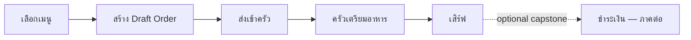

# 00 — ภาพรวม DDD Restaurant Handbook

Handbook นี้ใช้ร้านอาหาร dine-in หนึ่งสาขาเป็นกรณีศึกษาต่อเนื่อง เพื่อให้เห็นว่า DDD เริ่มจากภาษาธุรกิจและจบที่โปรแกรมที่รันและทดสอบได้ ไม่ใช่เริ่มจากตารางฐานข้อมูล

## Flow ที่จะสร้าง

MVP จบที่ waiter ส่ง order ที่ถูกต้องเข้าครัวและ kitchen board เห็น ticket. Billing เป็น optional capstone เพื่อไม่ให้บทแรกปนกับกฎการเงินและ payment integration.

## Reference implementation

- `Restaurant.Domain` — model และ business rules; อ้างอิงได้เฉพาะ BCL กับ Vogen
- `Restaurant.Application` — command/query orchestration
- `Restaurant.Infrastructure` — EF Core, SQLite และ Outbox
- `Restaurant.Api` — ASP.NET Core HTTP API
- `restaurant-web` — Vue 3 + TypeScript + Vite

ตรวจ implementation ได้ด้วย `dotnet test Restaurant.sln` และใน `src/restaurant-web` ให้รัน `npm run build && npm test`. API มี `GET /health` เพื่อยืนยัน host.

## สารบัญ

| บท | เนื้อหา |
|---|---|
| 00 | ภาพรวมและวิธีอ่าน handbook |
| 01 | Requirement สู่ domain language |
| 02 | ERD เทียบกับ DDD |
| 03 | Bounded Context และ Aggregate |
| 04 | Commands และ HTTP API |
| 05 | Domain Events และ eventual consistency |
| 06 | Queries และ Vue frontend |
| 07 | Persistence และ EF Core/SQLite |
| 08 | Reliability: Outbox, idempotency และ concurrency |
| 09 | Testing strategy |
| 10 | Delivery workflow |
| 11 | DDD กับ AI-assisted coding |

## วิธีอ่าน

แต่ละบทเรียงจาก scenario → language → modeling decision → lab → acceptance criteria. อย่าคัดลอกโค้ดโดยข้าม decision: test ของ domain คือ checkpoint ว่ากฎธุรกิจยังอยู่กับ aggregate ไม่ได้หลุดไปอยู่ใน API หรือ Vue.

## เส้นทางการอ่านสำหรับ SA

SA (System Analyst) ใช้กรณีศึกษาเดียวกันเพื่อฝึกค้นหา requirement, ยืนยันกฎกับคนร้าน และเชื่อมข้อตกลงไปถึงการตรวจรับ:

| ช่วง | คำถามหลัก | ผลลัพธ์การวิเคราะห์ |
|---|---|---|
| [บท 01](01-domain-language.md)–[03](03-bounded-context-and-aggregate.md) | ใครต้องการอะไร กฎมาจากไหน ใครเป็นเจ้าของการตัดสินใจ | question log, decision table และ boundary |
| [บท 04](04-commands-and-http-api.md)–[07](07-persistence-and-ef-core.md) | ใครทำได้ ข้อมูลมาจากไหน ผู้ใช้รู้ผลอย่างไร | permission matrix, data contract และ exception flow |
| [บท 08](08-reliability-outbox-and-concurrency.md)–[10](10-delivery-workflow.md) | ล้มเหลวแล้วทำอย่างไร พิสูจน์และตรวจรับอย่างไร | recovery scenario, traceability และ UAT |
| [บท 11](11-ddd-and-ai-assisted-coding.md) | ส่งต่อข้อตกลงให้ AI โดยไม่ให้เดากฎอย่างไร | task brief และ change impact |

ส่วนมุมมอง SA แยก **ข้อตกลง MVP** ที่ handbook ใช้อยู่แล้ว ออกจาก **คำถามรอยืนยัน / ภาคต่อ**. ตัวอย่างผู้ยืนยันและแบบฟอร์มเป็นแนวทางฝึกวิเคราะห์ ไม่ใช่หลักฐานว่าได้สัมภาษณ์คนร้านจริง; ความสามารถที่ระบุว่าเป็นภาคต่อยังไม่ใช่ acceptance criteria ของ lab ปัจจุบัน.
