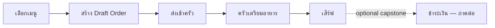

# 00 — ภาพรวม DDD Restaurant Handbook

Handbook นี้ใช้ร้านอาหาร dine-in หนึ่งสาขาเป็นกรณีศึกษาต่อเนื่อง เพื่อให้เห็นว่า DDD เริ่มจากภาษาธุรกิจและจบที่โปรแกรมที่รันและทดสอบได้ ไม่ใช่เริ่มจากตารางฐานข้อมูล

## Flow ที่จะสร้าง

MVP จบที่ waiter ส่ง order ที่ถูกต้องเข้าครัวและ kitchen board เห็น ticket. Billing เป็น optional capstone เพื่อไม่ให้บทแรกปนกับกฎการเงินและ payment integration.

## Reference implementation

- `Restaurant.Domain` — model และ business rules; อ้างอิงได้เฉพาะ BCL กับ Vogen
- `Restaurant.Application` — command/query orchestration ในบทถัดไป
- `Restaurant.Infrastructure` — EF Core, PostgreSQL และ Outbox ในบทหลัง
- `Restaurant.Api` — ASP.NET Core HTTP API
- `restaurant-web` — Vue 3 + TypeScript + Vite

ตรวจ M0 ได้ด้วย `dotnet test Restaurant.sln` และใน `src/restaurant-web` ให้รัน `npm run build && npm test`. API มี `GET /health` เพื่อยืนยัน host ก่อนมี business endpoint.

## วิธีอ่าน

แต่ละบทเรียงจาก scenario → language → modeling decision → lab → acceptance criteria. อย่าคัดลอกโค้ดโดยข้าม decision: test ของ domain คือ checkpoint ว่ากฎธุรกิจยังอยู่กับ aggregate ไม่ได้หลุดไปอยู่ใน API หรือ Vue.
