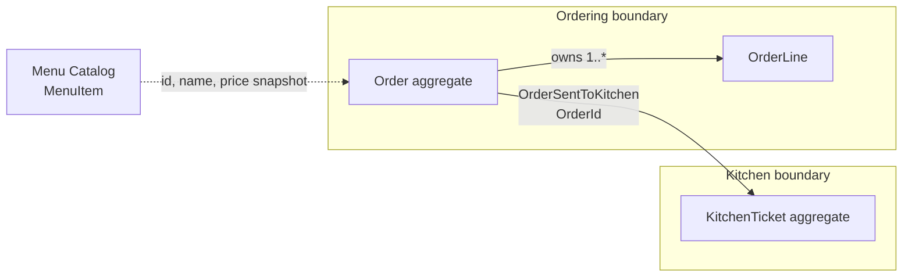

# 02 — ERD ต่างจาก DDD อย่างไร

ERD ตอบว่า “ข้อมูลใดสัมพันธ์กัน” ส่วน domain model ตอบว่า “ใครอนุญาตให้เปลี่ยนอะไร ภายใต้กฎใด” ทั้งสองมีประโยชน์ แต่ใช้แทนกันไม่ได้.

| มุมมอง | ตัวอย่าง `orders` และ `order_lines` | คำถามที่ตอบ |
|---|---|---|
| ERD | `order_lines.order_id` เชื่อมกับ `orders.id` | เก็บข้อมูลอย่างไร |
| Domain model | `Order.SendToKitchen()` ปฏิเสธ order ว่าง | เปลี่ยนสถานะได้เมื่อไร |
| Read model | kitchen board แสดงเฉพาะงานที่ต้องทำ | UI ต้องอ่านอะไรเร็ว |

## จาก ERD สู่ domain boundary

ERD อาจวาดความสัมพันธ์เป็น `orders 1 ── * order_lines` และ `kitchen_tickets.order_id` ได้ถูกต้อง แต่เส้น foreign key ไม่ได้บอกว่าใครเป็นเจ้าของกฎหรือ transaction. ภาพเดียวกันเมื่อมองแบบ DDD ต้องแยก ownership ให้เห็น:



`OrderLine` อยู่ภายใน `Order` เพราะต้องเปลี่ยนผ่าน behavior ของ `Order`. ส่วน `KitchenTicket` เป็น aggregate ของ Kitchen: มันรับเพียง fact จาก event และอ้าง order ด้วย `OrderId` ไม่ใช่ child หรือ navigation property ของ `Order`. หาก persistence เลือกใช้ foreign key เพื่อ integrity, constraint นั้นไม่ย้าย business ownership ข้าม boundary.

## Entity มี identity และ lifecycle

Entity คือ object ที่ระบุตัวตนด้วย identity ไม่ใช่ค่าภายในเพียงอย่างเดียว. `Order` ที่มี `OrderId` เดิมยังเป็น order เดิม แม้เพิ่มรายการ เปลี่ยนสถานะ หรือยอดรวมเปลี่ยนไป. `MenuItem` และ `KitchenTicket` ก็เป็น Entity ด้วยเหตุผลเดียวกัน: มี identity และ lifecycle ของตัวเอง.

`OrderLine` มี lifecycle อยู่ภายใต้ `Order` ใน model นี้ จึงไม่ควรถูกแก้หรือจัดการจากภายนอกโดยตรง แต่เปลี่ยนผ่าน behavior ของ `Order` เช่น `AddItem` และ `RemoveItem`.

ต่างจาก Value Object ซึ่งเทียบกันด้วยค่า ไม่มี identity และควร immutable. ตัวอย่างเช่น `Money(100m)` สองค่าเท่ากันเมื่อจำนวนเงินเท่ากัน; การเปลี่ยนราคาให้สร้าง `Money` ค่าใหม่แทนการแก้ object เดิม.

| Concept | ตัวอย่างใน handbook | ใช้ระบุตัวตนด้วย | การเปลี่ยนแปลง |
|---|---|---|---|
| Entity | `Order`, `MenuItem`, `KitchenTicket` | ID | เปลี่ยน state ได้ตลอด lifecycle |
| Value Object | `Money`, `Quantity`, `TableNumber` | ค่า | สร้างค่าใหม่แทนการแก้ค่าเดิม |
| Aggregate Root | `Order`, `KitchenTicket` | ID | เป็นทางเข้าควบคุม Entity ภายในและ invariant |

## เมื่อ primitive มีความหมายทางธุรกิจ ให้สร้าง Value Object

Developer มักเริ่มด้วย method หน้าตาแบบนี้:

```csharp
void CreateOrder(Guid id, int tableNumber, decimal price, int quantity)
```

โค้ดต่อไปนี้ compile ได้ เพราะ C# เห็นเพียง `Guid`, `int` และ `decimal`:

```csharp
CreateOrder(menuItemId, -3, -50m, 0);
```

แต่ธุรกิจเห็นปัญหาทันที: `menuItemId` ไม่ใช่ `orderId`, โต๊ะต้องมากกว่า 0, ราคาไม่ติดลบ และจำนวนต้องมากกว่า 0. Primitive ไม่บอกความหมายและไม่มีที่กลางสำหรับกฎเหล่านี้.

Lab ใช้ Vogen สร้าง `OrderId`, `MenuItemId`, `TableNumber`, `Quantity` และ `Money` เพื่อให้ validation และ type safety อยู่ที่ขอบเขตของข้อมูล:

```csharp
[ValueObject<int>]
public readonly partial struct TableNumber;
```

เมื่อใช้แล้ว code จะรับค่าเช่น `TableNumber table`, `Money price` และ `Quantity quantity` แทน primitive เปล่า ๆ. จึงสลับ `OrderId` กับ `MenuItemId` ไม่ได้ตั้งแต่ compile และสร้าง `TableNumber.From(0)` หรือ `Money.From(-10m)` ไม่ได้.

Value Object ไม่ใช่ข้ออ้างให้ห่อทุกชนิด: `retryCount` หรือ `pageSize` ยังเป็น `int` ปกติได้. สร้าง Value Object เมื่อ primitive มีภาษา กฎ หรือความเสี่ยงที่จะสลับกันใน domain.

## Common mistake

อย่าให้ endpoint รับ `OrderDto`, แก้ `Status = "Sent"`, แล้วบันทึก. วิธีนั้นไม่มีที่กลางที่ป้องกัน order ว่างหรือการแก้หลังส่งครัว. ใน lab domain ให้ test เรียก behavior ของ `Order` ตรง ๆ ก่อนมี EF หรือ HTTP.
