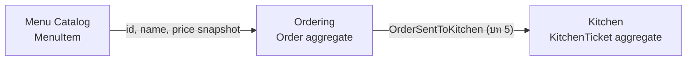
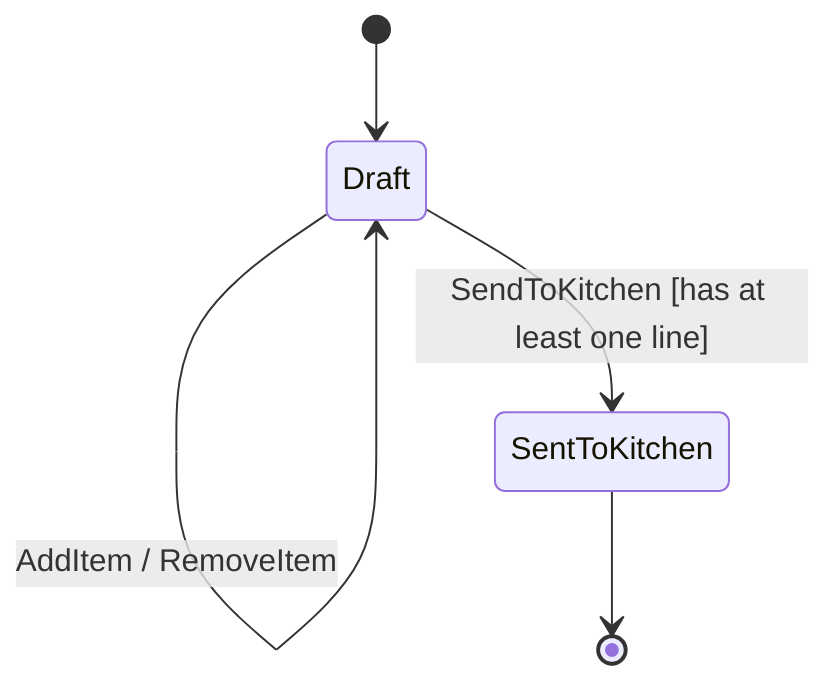

# 03 — Bounded Context และ Aggregate

## Boundaries



Ordering เป็นเจ้าของการตัดสินใจว่า order ไหนพร้อมส่งครัว. Kitchen เป็นเจ้าของคิวและสถานะการเตรียมอาหาร. จึงไม่ควรให้ `Order` ถือ `KitchenTicket` เป็น object graph เดียวกัน แม้ทั้งคู่จะถูกเก็บใน SQLite database เดียวใน modular monolith.

ตอนเพิ่มรายการ Ordering รับเพียง `MenuItemId`, ชื่อ และราคาที่เป็น snapshot ณ เวลาสั่ง. `Order` ไม่ถือ `MenuItem` และไม่ย้อนกลับไปอ่านราคาปัจจุบันจาก Menu Catalog เพราะ order เดิมต้องเก็บข้อตกลงที่เกิดขึ้นแล้ว.

## Aggregate contract: Order

`Order` เป็น transaction boundary ของ Ordering:

- `Create(orderId, tableNumber)` สร้าง Draft order
- `AddItem(menuItemId, itemName, unitPrice, quantity)` เพิ่มหรือรวม line
- `RemoveItem(menuItemId)` ลบ line
- `SendToKitchen()` เปลี่ยน Draft เป็น SentToKitchen เมื่อมี line
- `Total` มาจากผลรวม line subtotals ไม่รับค่าจาก caller
- `Lines` เปิดให้อ่านได้เท่านั้น; การเพิ่ม ลบ หรือเปลี่ยน line ต้องผ่าน behavior ของ `Order`



ในบทนี้ `SendToKitchen()` ทำเพียง state transition. บท 5 จะเพิ่ม domain event และให้ application layer สร้าง `KitchenTicket` หลัง commit อย่างปลอดภัย.

## Checkpoint

ทำให้ domain tests ครอบคลุมทุก rule ในบท 1 รวมถึง total และ state transition. Lab นี้ยังไม่ควรมี EF mapping, controller, repository หรือ event delivery เพราะสิ่งเหล่านั้นจะกลบ behavior ของ aggregate ที่กำลังเรียนรู้.

## Acceptance criteria

```gherkin
Given a draft order with one line
When code outside the Order tries to mutate its Lines collection
Then the operation is rejected and the order is unchanged

Given a draft order with at least one line
When the waiter sends it to kitchen
Then the order changes to SentToKitchen

Given a sent order
When the waiter tries to add a line
Then the operation is rejected

Given a sent order
When the waiter tries to remove a line
Then the operation is rejected
```
