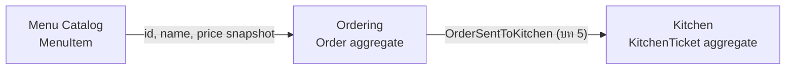
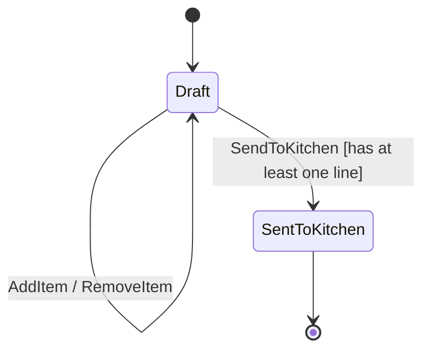

# 03 — Bounded Context และ Aggregate

## Boundaries



Ordering เป็นเจ้าของการตัดสินใจว่า order ไหนพร้อมส่งครัว. Kitchen เป็นเจ้าของคิวและสถานะการเตรียมอาหาร. จึงไม่ควรให้ `Order` ถือ `KitchenTicket` เป็น object graph เดียวกัน แม้ทั้งคู่จะถูกเก็บใน SQLite database เดียวใน modular monolith.

ตอนเพิ่มรายการ Ordering รับเพียง `MenuItemId`, ชื่อ และราคาที่เป็น snapshot ณ เวลาสั่ง. `Order` ไม่ถือ `MenuItem` และไม่ย้อนกลับไปอ่านราคาปัจจุบันจาก Menu Catalog เพราะ order เดิมต้องเก็บข้อตกลงที่เกิดขึ้นแล้ว.

## Aggregate contract: Order

`Order` เป็นทั้ง Entity และ Aggregate Root: มี `OrderId` เป็น identity ของตัวเอง และเป็นจุดเดียวที่อนุญาตให้เปลี่ยน `OrderLine` เพื่อรักษา invariant ของ Ordering. ดังนั้น `Order` จึงเป็น transaction boundary ของ Ordering:

- `Create(orderId, tableNumber)` สร้าง Draft order
- `AddItem(menuItemId, itemName, unitPrice, quantity)` เพิ่มหรือรวม line
- `RemoveItem(menuItemId)` ลบ line
- `SendToKitchen()` เปลี่ยน Draft เป็น SentToKitchen เมื่อมี line
- `Total` มาจากผลรวม line subtotals ไม่รับค่าจาก caller
- `Lines` เปิดให้อ่านได้เท่านั้น; การเพิ่ม ลบ หรือเปลี่ยน line ต้องผ่าน behavior ของ `Order`



ในบทนี้ `SendToKitchen()` ทำเพียง state transition. บท 5 จะเพิ่ม domain event และให้ application layer สร้าง `KitchenTicket` หลัง commit อย่างปลอดภัย.

## Checkpoint

ทำให้ domain tests ครอบคลุมทุก rule ในบท 1 รวมถึง total และ state transition. Lab นี้ยังไม่ควรมี EF mapping, controller, repository หรือ event delivery เพราะสิ่งเหล่านั้นจะกลบ behavior ของ aggregate ที่กำลังเรียนรู้.

## Acceptance criteria

```gherkin
Given a draft order with one line
When code outside the Order tries to mutate its Lines collection
Then the operation is rejected and the order is unchanged

Given a draft order with at least one line
When the waiter sends it to kitchen
Then the order changes to SentToKitchen

Given a sent order
When the waiter tries to add a line
Then the operation is rejected

Given a sent order
When the waiter tries to remove a line
Then the operation is rejected
```

## มุมมอง SA: จุดส่งต่องานและ exception flow

Boundary ควรอธิบายได้ด้วยผู้รับผิดชอบและข้อตกลงของงาน ไม่ใช่ชื่อ service เพียงอย่างเดียว. ใช้ flow ตั้งแต่ Waiter เลือกโต๊ะ → Ordering เก็บ draft → ยืนยันส่ง → Kitchen สร้าง ticket เป็นจุดเริ่มต้น แล้วตรวจกรณีที่งานออกจาก flow ปกติ:

| เหตุการณ์ | ข้อตกลง MVP | คำถามรอยืนยัน / ภาคต่อ |
|---|---|---|
| เลือกโต๊ะผิด | Order เก็บ table number ตอนสร้าง; ไม่มี command ย้ายโต๊ะในบทนี้ | ใครแก้ได้ ต้องเก็บประวัติหรือแจ้งครัวเมื่อใด |
| ต้องการแก้รายการหลังส่ง | Ordering ปฏิเสธตาม BR-02 | ใช้คำขอยกเลิกหรือ order เพิ่มเติม และใครอนุมัติ |
| อาหารหมดหลังเพิ่มรายการ | ยังไม่มี availability workflow ของ Menu Catalog | ตรวจตอนเพิ่มหรือตอนส่ง และใครเสนอรายการทดแทน |
| ส่ง order แล้ว ticket ยังไม่เกิด | Ordering กับ Kitchen มีจุด commit แยกกัน | อ่าน recovery contract ของบท 08; อย่าถือว่าครัวเริ่มทำแล้ว |

### คำถามที่ SA ต้องตอบ

- ใครเป็นเจ้าของคำว่า “ส่งแล้ว”, “รับงานแล้ว” และ “เริ่มทำแล้ว”; เป็นเหตุการณ์เดียวกันจริงหรือไม่
- ข้อมูลใดต้องถูกต้องพร้อมกันภายใน Order และผลลัพธ์ใดยอมให้เกิดตามหลังได้
- ข้อยกเว้นต้องเปลี่ยนกฎเดิม หรือเป็น use case ใหม่ที่ประสานหลาย boundary

**ตัวอย่างผลลัพธ์การวิเคราะห์:** Ordering เป็นเจ้าของกฎส่ง order; Kitchen เป็นเจ้าของงานครัว; `OrderSentToKitchen` คือข้อตกลงส่งต่อข้อมูล. MVP ยังไม่มีการยืนยันรับงานจากคนครัวหรือ workflow ยกเลิก จึงต้องบันทึกแยกเป็นภาคต่อ.
