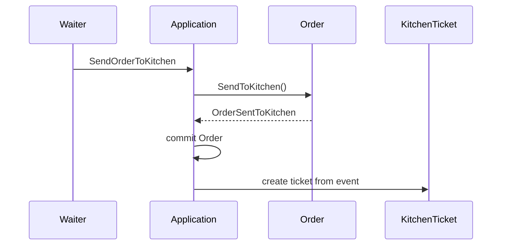

# 05 — Domain Events และ Eventual Consistency

เมื่อ waiter ส่ง order สำเร็จ สิ่งที่เกิดขึ้นในธุรกิจคือ “order นี้ถูกส่งเข้าครัวแล้ว” ไม่ใช่ “แก้ตาราง kitchen tickets”. ข้อเท็จจริงนั้นคือ domain event `OrderSentToKitchen`; Kitchen จึงตอบสนองต่อ event และสร้างงานของตัวเอง.

## Event เป็น business fact

`OrderSentToKitchen` เป็นอดีตกาลและ immutable. Event มี `OrderId`, `TableNumber` และ snapshot ของแต่ละรายการที่ครัวต้องทำ (`MenuItemId`, ชื่อ, จำนวน). Event ไม่บรรทุก `Order` object หรือ mutable line collection ข้าม aggregate boundary และไม่ส่งราคาซึ่ง Kitchen ไม่ได้ใช้.

`Order.SendToKitchen()` raise event เฉพาะเมื่อ state transition สำเร็จเท่านั้น. หาก order ว่างหรือถูกส่งแล้ว Domain จะ reject ก่อน จึงไม่มี event ใหม่.



## Consistency boundary

`Order` กับ `KitchenTicket` เป็นคนละ aggregate จึงไม่แก้ทั้งคู่จาก method เดียวใน Domain. Application รอให้ save `Order` สำเร็จก่อน แล้วจึง dispatch event เพื่อสร้าง `KitchenTicket`.

Lab นี้ใช้ in-memory dispatcher เพื่อให้เห็นลำดับการทำงานเท่านั้น. มันยังไม่ทนต่อ process crash และไม่ได้รับประกัน delivery. บท Reliability จะเปลี่ยนจุด dispatch นี้เป็น Outbox และเพิ่ม idempotency; อย่าเพิ่ม message broker หรือ retry policy ในบทนี้.

## Aggregate contract: KitchenTicket

`KitchenTicket` เป็น aggregate ของ Kitchen และอ้าง `Order` ด้วย `OrderId` เท่านั้น. ใน milestone นี้ `OrderId` เป็น key ของ ticket เพราะหนึ่ง order สร้างได้หนึ่ง ticket; ticket เก็บ table number และรายการที่ต้องทำ. Kitchen จะเพิ่มสถานะเตรียมอาหารและ kitchen board ในบทถัดไป.

## Implementation lab

1. ให้ `Order` เก็บ domain events ภายในและมีทาง dequeue ที่ไม่เปิดให้ caller เพิ่ม event เอง
2. ให้ `Order.SendToKitchen()` เปลี่ยน status ก่อน แล้ว raise `OrderSentToKitchen` หนึ่งครั้ง
3. หลัง `IOrderRepository.Save(order)` ให้ Application dispatch events ที่ dequeue แล้ว
4. handler ของ `OrderSentToKitchen` สร้างและ save `KitchenTicket` ผ่าน repository ของ Kitchen

HTTP contract `POST /orders/{orderId}/send-to-kitchen` ยังตอบ `204 No Content` เหมือนบท 4. Kitchen board query จะเป็นงานของบท 6 ไม่ใช่เหตุผลให้ handler deserialize `Order` มาอ่าน.

## Acceptance criteria

```gherkin
Given a draft order with at least one line
When the waiter sends it to kitchen
Then the order is saved as SentToKitchen
And one KitchenTicket is created for that order

Given a draft order with no lines
When the waiter tries to send it to kitchen
Then the operation is rejected with code "order.empty"
And no KitchenTicket is created

Given an order that was already sent to kitchen
When the waiter sends it again
Then the operation is rejected with code "order.not-draft"
And no additional KitchenTicket is created
```

## Common mistakes

- สร้าง `KitchenTicket` ตรงใน `Order.SendToKitchen()` ทำให้ Ordering ถือ responsibility ของ Kitchen
- dispatch event ก่อน save order ทำให้ Kitchen เห็น ticket ทั้งที่ Order commit ไม่สำเร็จ
- ใช้ event เป็น DTO ที่บรรทุก aggregate ทั้งก้อน
- อ้างว่า in-memory dispatch reliable แล้ว และข้าม Outbox/idempotency ในบท 8

## Checkpoint

Domain test ต้องพิสูจน์ว่า successful transition raise event หนึ่งครั้ง และ rejected transition ไม่ raise. Application หรือ integration test ต้องพิสูจน์ว่า event ถูก handle หลัง save และสร้าง ticket เพียงหนึ่งใบ. `dotnet test Restaurant.sln` ต้องผ่านก่อนเริ่ม query และ Vue kitchen board.

## มุมมอง SA: นิยามคำว่า “ส่งครัวสำเร็จ”

แยกจุดสังเกตผลเพื่อไม่ให้ผู้ใช้กับทีมพัฒนาเข้าใจคำว่า success ต่างกัน:

| จุดสังเกต | หลักฐาน | สิ่งที่ยังสรุปไม่ได้ |
|---|---|---|
| Ordering บันทึกการส่งแล้ว | Order เป็น `SentToKitchen` | Kitchen มี ticket แล้วหรือยัง |
| Kitchen มีงานแล้ว | query พบ ticket ของ OrderId นั้น | คนครัวเห็นหรือเริ่มทำแล้วหรือยัง |
| คนครัวยืนยันรับ/เริ่มทำ | ต้องมี use case และหลักฐานเพิ่มในภาคต่อ | MVP ยังไม่มีสถานะนี้ |

ใน lab บทนี้ dispatcher ทำงานใน process และมี crash window ตามที่อธิบายไว้. เมื่อใช้ Outbox ในบท 08, `204` ของการส่งหมายถึง Order และข้อความส่งต่อถูก commit แล้ว แม้ processor ล้มและ ticket ยังไม่เกิด; จึงไม่ใช่หลักฐานว่าคนครัวรับงานแล้ว.

**คำถามที่ SA ต้องตอบ:** ธุรกิจถือว่าจบงานเมื่อรับคำสั่งหรือเมื่อครัวเห็น ticket? หากสองเหตุการณ์ห่างกัน ผู้ใช้ต้องรู้อะไรและใครติดตาม? ใน MVP เป้าหมาย end-to-end ยังเป็น ticket ปรากฏบน board แต่ผลของ command กับผลของ delivery ต้องตรวจแยกกัน.

**ตัวอย่างผลลัพธ์การวิเคราะห์:** แยก AC ส่ง order สำเร็จออกจาก AC สร้าง/อ่าน ticket และเพิ่มกรณี delivery ล้มเหลวตามบท 08. ไม่ต้องเพิ่มสถานะใหม่ให้ `Order` เพียงเพื่ออธิบายจุดสังเกตเหล่านี้.
