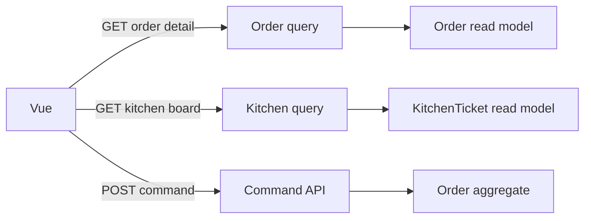

# 06 — Queries และ Vue Frontend

Command เปลี่ยน state; query อ่าน state ที่ UI ต้องใช้. Vue ไม่ควร deserialize `Order` aggregate หรือคำนวณ business rule เอง. API ส่ง read model ที่ตรงกับหน้าจอ และ aggregate ยังคงเป็นที่เดียวที่ยืนยัน invariant เมื่อ command ถูกส่งกลับมา.

## Read models

| Query | HTTP | Read model | กรณีพิเศษ |
|---|---|---|---|
| `GetOrderDetail` | `GET /orders/{orderId}` | table, status, lines และ total ของ order | order ไม่พบเป็น `404` |
| `GetKitchenBoard` | `GET /kitchen-board` | tickets พร้อมโต๊ะและรายการที่ต้องทำ | board ว่างตอบ `200 []` |

Application query service map aggregate ไปเป็น DTO ก่อนคืน API. Query อ่าน `Order` และ `KitchenTicket` ได้ แต่ห้ามเปิด collection ที่ mutable, reuse command handler, หรือเปลี่ยน state ระหว่างอ่าน.



## Vue workflow ของ M3

หน้าจอเดียวแสดง waiter workflow และ kitchen board เพื่อ demo flow ให้จบ:

1. waiter เลือกโต๊ะจากแผนผัง layout ร้าน แล้วสร้าง Draft order
2. waiter เพิ่มรายการตัวอย่างจาก menu ที่กำหนดตายตัวใน UI ชั่วคราว
3. UI อ่าน order detail เพื่อแสดง line, total และ status
4. waiter ส่งครัว; UI แสดง business error ที่ API คืนมา หรือ refresh order เมื่อสำเร็จ
5. kitchen board โหลดหรือ refresh แล้วเห็น ticket ใหม่

แผนผังใน lab เป็น static MVP layout ที่ map ปุ่มแต่ละโต๊ะกับ table number เดิม; เมื่อมีผังร้านจริงจึงค่อยย้าย layout ไปเป็น configuration หรือ query ของร้าน. รายการตัวอย่างเป็นเพียง placeholder เพราะ Menu Catalog ยังไม่มี API. อย่าเรียกมันว่า source of truth และอย่าเก็บราคาเป็น state ที่แก้เองใน Vue; payload จะกลายเป็น order-line snapshot เมื่อ command สำเร็จ.

## Wireframe

```text
┌──────────────────────── Waiter order ───────────────────────┐
│ Select a table on the floor plan                             │
│  Window        Center             Patio                      │
│  [T1] [T2]     [T4] [T5]          [T8] [T9]                  │
│  [T3]          [T6] [T7]                                    │
│                                                               │
│  Selected table: T4        [Create order]                    │
│                                                               │
│  Order #… · Table 4 · Draft                                  │
│  [Add Pad Thai] [Add Iced Tea]                                │
│  • Pad Thai × 1                                               │
│  Total: ฿85                         [Send to kitchen]        │
│  ! Only draft orders can be changed.                          │
└──────────────────────────────────────────────────────────────┘

┌──────────────────────── Kitchen board ──────────────────────┐
│ [Refresh board]                                               │
│  Table 4: Pad Thai × 1                                        │
│                                                               │
│  Empty state: ยังไม่มีงานในครัว                              │
└──────────────────────────────────────────────────────────────┘
```

Wireframe นี้แสดง state หลักในหน้าเดียว: ก่อนเลือกโต๊ะ, draft ที่แก้ได้, business error และ kitchen board ที่มีหรือไม่มี ticket. หน้าจอจริงอาจวางสองส่วนนี้แบบ responsive เป็นคอลัมน์หรือเรียงลงมาได้ โดย information hierarchy เดิมต้องคงอยู่.

## UI states ที่ต้องมี

| พื้นที่ | Loading | Empty | Error |
|---|---|---|---|
| เลือกโต๊ะ / Order detail | disable action ระหว่าง request | ยังไม่เลือกหรือยังไม่สร้าง order | แสดง Problem Details `detail` |
| Send to kitchen | disable ปุ่มระหว่าง submit | draft ที่ยังไม่มี line ส่งไม่ได้ | แสดง business error เช่น `order.empty` |
| Kitchen board | แสดงสถานะกำลังโหลด | “ยังไม่มีงานในครัว” | ปุ่ม refresh ยังใช้งานได้เพื่อ retry |

Vue validation ช่วยลด round trip เช่น table number ต้องมากกว่า 0 แต่ไม่ได้แทน domain validation. API error โดยเฉพาะ `order.not-draft` ต้องถูกแสดง เพราะผู้ใช้คนอื่นหรือ request อื่นอาจเปลี่ยน order ไปแล้ว.

## Acceptance criteria

```gherkin
Given a waiter selects a table from the restaurant layout
When the waiter creates an order
Then the API receives the selected table number and the UI shows a Draft order

Given a draft order with one line
When the waiter opens its detail view
Then the UI shows its table, line snapshot, total, and Draft status

Given the kitchen board has no tickets
When the kitchen view loads
Then the UI shows an empty state instead of an error

Given a waiter sends a populated order to kitchen
When the kitchen board is refreshed
Then it shows one ticket with that order's table and line

Given the API rejects a command with a business error
When Vue receives the Problem Details response
Then the UI shows the error detail and leaves the user able to retry when appropriate
```

## ตัวอย่าง Kanban Story สำหรับ SA

**Story — Waiter เปิด order จากผังร้านและส่งเข้าครัว**

ในฐานะ waiter ฉันต้องเลือกโต๊ะจากผังร้าน สร้าง draft order, เพิ่มรายการ และส่งครัว เพื่อให้ครัวเห็นงานของโต๊ะนั้นบน kitchen board.

| ส่วน | งานที่เพิ่มเข้า board | Done เมื่อ |
|---|---|---|
| SA | ยืนยัน table number ของทุกโต๊ะใน layout, รายการเมนูตัวอย่าง และข้อความ business error ที่ผู้ใช้เข้าใจ | wireframe และ acceptance criteria ได้รับการยอมรับ |
| Backend | `GET /orders/{id}` และ `GET /kitchen-board` คืน read DTO; unknown order เป็น `404` | integration tests ยืนยัน shape ของ DTO, empty board และ populated board |
| Frontend | แสดง floor plan, selected table, draft order, add/send actions และ kitchen board | loading, empty และ error states ตรงตาม wireframe |
| Test | ทดสอบ send แล้ว ticket ปรากฏบน board; ทดสอบ API error แสดงใน UI | automated tests ผ่านและ demo flow จบได้ |

**Out of scope:** Menu Catalog จริง, kitchen status transition, persistence และ retry/Outbox. ขอบเขตนี้ทำให้ story ส่งมอบ vertical slice ได้โดยไม่ดึงงานของบทถัดไปเข้ามา.

## Common mistakes

- คืน `Order` entity จาก API แล้วผูก Vue กับ shape ภายในของ aggregate
- ใช้ `GET` handler เรียก `SendToKitchen()` หรือ mutation อื่นเพื่อ “update ก่อนแสดง”
- treat board ว่างเป็น error
- ซ่อน Problem Details แล้วแสดงเพียง “Something went wrong”
- เพิ่ม Menu Catalog หรือ kitchen status machine ในบทนี้ ทั้งที่ยังไม่มี query/use case รองรับ

## Checkpoint

Integration test ต้องยืนยัน response ของ query ทั้ง order detail, unknown order และ empty/populated kitchen board. Vue test ต้องยืนยัน loading, empty และ business-error state; `npm run build && npm test` และ `dotnet test Restaurant.sln` ต้องผ่านก่อนเพิ่ม persistence ในบท 7.
