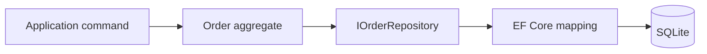

# 07 — Persistence และ EF Core

EF Core เก็บ state ของ aggregate แต่ไม่ควรกำหนด business behavior. `Order.Create`, `AddItem` และ `SendToKitchen` ยังเป็นทางเดียวที่เปลี่ยน `Order`; repository เพียง rehydrate aggregate จาก SQLite แล้ว save state ที่ behavior เปลี่ยนไว้.

## Mapping decision

| Domain concept | Persistence shape | เหตุผล |
|---|---|---|
| `Order` | ตาราง `orders` | aggregate root ของ Ordering |
| `OrderLine` | owned rows ใน `order_lines` | line ไม่มี lifecycle นอก Order |
| `KitchenTicket` | ตาราง `kitchen_tickets` | aggregate root ของ Kitchen |
| ticket line | owned rows ใน `kitchen_ticket_lines` | lifecycle อยู่กับ ticket |
| Value Objects | scalar columns ผ่าน EF conversion | database เก็บ primitive แต่ code ยังรักษา type safety |
| `DomainEvents` | ไม่ map | event เป็นงาน pending ใน memory ไม่ใช่ order state |

mapping อยู่ใน `Restaurant.Infrastructure`; ห้ามใส่ EF attributes หรือ `DbContext` reference ลง Domain. `OrderId`, `TableNumber`, `Money` และ `Quantity` ถูกแปลงเข้า/ออกจาก primitive ที่ขอบ persistence เท่านั้น.



## Transaction boundary และ event

Application save `Order` ก่อน แล้ว dispatch `OrderSentToKitchen` เพื่อ save `KitchenTicket`. ทั้งสอง aggregate ไม่ถูกแก้จาก domain method เดียวกัน. ใน milestone นี้ process crash ระหว่างสอง save ยังทำให้ ticket หายได้; จุดนี้เป็นข้อจำกัดที่ตั้งใจไว้และจะถูกแก้ด้วย Outbox/idempotency ในบท 8.

## Local database และ migration

API อ่าน SQLite connection string จาก configuration. local lab ไม่ต้องเปิด database service เพิ่ม; SQLite จะสร้างไฟล์ database ตาม connection string เมื่อ apply migration.

สร้างและใช้ migration จาก startup project ของ API:

```sh
dotnet ef migrations add InitialPersistence \
  --project src/Restaurant.Infrastructure \
  --startup-project src/Restaurant.Api

dotnet ef database update \
  --project src/Restaurant.Infrastructure \
  --startup-project src/Restaurant.Api
```

อย่าให้ API apply migration ตอน start เพราะ schema deployment ต้องควบคุมได้. การ rollback ใช้ `dotnet ef database update <previous-migration>` หลังยืนยัน target database; migration แรกไม่มี previous migration จึงไม่มี rollback อัตโนมัติโดยไม่ล้างข้อมูล.

## Verification strategy

Integration test ใช้ relational SQLite in-memory เพื่อให้ test รันได้ทุกเครื่องและยังตรวจ EF mapping จริง. Test ต้องยืนยันว่า request หนึ่งเขียน order/ticket แล้ว request หรือ scope ถัดไปอ่าน read model เดิมได้. ก่อน release ให้ apply migration กับ SQLite file จริงและ smoke test การ restart API.

## Acceptance criteria

```gherkin
Given SQLite has no order for a new id
When the API creates an order, adds an item, and sends it to kitchen
Then a later request can read the same order detail and kitchen ticket

Given an Order with multiple lines
When EF Core saves and reloads it
Then table number, status, line snapshots, quantities, and total are preserved

Given a domain event is pending after Order is saved
When the application dispatches it
Then KitchenTicket is saved separately from Order
```

## Common mistakes

- expose `DbSet` หรือ `DbContext` ให้ API/Vue ใช้เป็น repository โดยตรง
- map domain event เป็น permanent order history ทั้งที่ยังไม่มี delivery design
- save line แยกจาก `Order` จน bypass aggregate boundary
- auto-run migration ทุก API instance ตอน start
- อ้างว่า transaction สอง aggregate reliable แล้วทั้งที่ยังไม่มี Outbox

## Checkpoint

`dotnet test Restaurant.sln` ต้องผ่านโดยไม่ต้องเปิด Docker. ให้ apply migration แล้ว restart API และยืนยันว่า `GET /orders/{id}` กับ `GET /kitchen-board` ยังอ่าน state เดิมจาก SQLite file ได้. จากนั้นจึงเริ่มบท 8 เพื่อทำ delivery ที่ทนต่อ failure.
