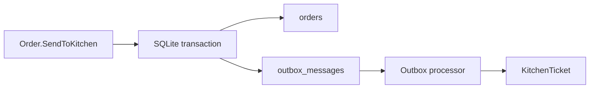

# 08 — Reliability: Outbox, Idempotency และ Concurrency

การ save `Order` แล้วสร้าง `KitchenTicket` ต่อทันทีมี failure window: process อาจล่มหลัง order ถูก commit แต่ก่อน ticket ถูกสร้าง. Outbox แก้โดยเก็บ business event เป็น message ใน database transaction เดียวกับ aggregate.



## Outbox contract

- `OrderSentToKitchen` ถูก serialize เป็น outbox message พร้อม save Order
- processor อ่านเฉพาะ pending message และ mark processed หลัง handler สำเร็จ
- handler fail แล้ว message ยัง pending เพื่อ retry รอบถัดไป
- `KitchenTicket` ใช้ `OrderId` เป็น idempotency key: message เดิมซ้ำต้องไม่สร้าง ticket ซ้ำ

Outbox ไม่ได้ทำให้ delivery exactly-once; มันทำให้ at-least-once delivery ปลอดภัยเมื่อ consumer idempotent.

## Optimistic concurrency

Order record มี version เป็น concurrency token. หาก waiter สองคนอ่าน draft เดียวกัน คนแรก save สำเร็จและเพิ่ม version; คนที่สอง save จาก version เก่าจะได้ `409 Conflict` พร้อม code ที่ stable. UI refresh order แล้วให้ผู้ใช้ตัดสินใจใหม่ แทนการเขียนทับเงียบ ๆ.

## Acceptance criteria

```gherkin
Given a populated draft order
When it is sent to kitchen
Then Order and one pending Outbox message are saved atomically

Given a pending OrderSentToKitchen message
When the processor handles it twice
Then exactly one KitchenTicket exists for the order

Given two clients edit the same draft order version
When the first client saves before the second
Then the second client receives 409 and does not overwrite the first change
```

## Checkpoint

Integration tests prove pending messages survive before processing, failed processing remains retryable, repeated delivery is idempotent, and stale version returns `409`. A later hosted worker or external broker may invoke the processor, but is deliberately out of scope here.
