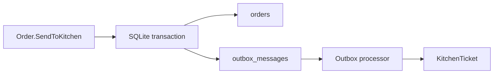

# 08 — Reliability: Outbox, Idempotency และ Concurrency

การ save `Order` แล้วสร้าง `KitchenTicket` ต่อทันทีมี failure window: process อาจล่มหลัง order ถูก commit แต่ก่อน ticket ถูกสร้าง. Outbox แก้โดยเก็บ business event เป็น message ใน database transaction เดียวกับ aggregate.



## Outbox contract

- `OrderSentToKitchen` ถูก serialize เป็น outbox message พร้อม save Order
- processor อ่านเฉพาะ pending message และ mark processed หลัง handler สำเร็จ
- handler fail แล้ว message ยัง pending เพื่อ retry รอบถัดไป
- `KitchenTicket` ใช้ `OrderId` เป็น idempotency key: message เดิมซ้ำต้องไม่สร้าง ticket ซ้ำ

ใน lab นี้ API พยายาม process outbox หลัง commit ของ `send-to-kitchen` เพื่อให้ demo เห็น ticket ทันที. หาก processor ล้ม request ส่ง order ยังสำเร็จและ message คง pending; ผู้ดูแลเรียก `POST /outbox/process` เพื่อ retry ได้. นี่คือ trigger ที่อยู่ใน scope ของ lab; hosted worker หรือ broker เป็นภาคต่อ ไม่ใช่สิ่งที่แอบทำงานอยู่เบื้องหลัง.

Outbox ไม่ได้ทำให้ delivery exactly-once; มันทำให้ at-least-once delivery ปลอดภัยเมื่อ consumer idempotent.

## Optimistic concurrency

Order record มี version เป็น concurrency token. `GET /orders/{id}` คืน version และ command request ส่งกลับมาใน field `version`. หาก waiter สองคนอ่าน draft เดียวกัน คนแรก save สำเร็จและเพิ่ม version; คนที่สองส่ง version เก่าจะได้ `409 Conflict` พร้อม code `order.concurrency`. UI reload order แล้วให้ผู้ใช้ตัดสินใจใหม่ แทนการเขียนทับเงียบ ๆ.

## Acceptance criteria

```gherkin
Given a populated draft order
When it is sent to kitchen
Then Order and one pending Outbox message are saved atomically

Given a pending OrderSentToKitchen message
When the processor handles it twice
Then exactly one KitchenTicket exists for the order

Given two clients edit the same draft order version
When the first client saves before the second
Then the second client receives 409 with code "order.concurrency" and does not overwrite the first change
```

## Checkpoint

Integration test ต้องพิสูจน์ว่า message ยังคง pending ก่อนถูก process, การ process ที่ล้มเหลว retry ได้, การส่งซ้ำ idempotent และ version เก่าตอบ HTTP `409` พร้อม `order.concurrency`. hosted worker หรือ external broker อาจเป็นผู้เรียก processor ในอนาคต แต่ตั้งใจอยู่นอกขอบเขตของบทนี้.
