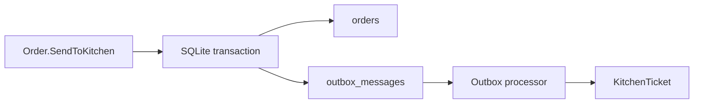

# 08 — Reliability: Outbox, Idempotency และ Concurrency

การ save `Order` แล้วสร้าง `KitchenTicket` ต่อทันทีมี failure window: process อาจล่มหลัง order ถูก commit แต่ก่อน ticket ถูกสร้าง. Outbox แก้โดยเก็บ business event เป็น message ใน database transaction เดียวกับ aggregate.



## Outbox contract

- `OrderSentToKitchen` ถูก serialize เป็น outbox message พร้อม save Order
- processor อ่านเฉพาะ pending message และ mark processed หลัง handler สำเร็จ
- handler fail แล้ว message ยัง pending เพื่อ retry รอบถัดไป
- `KitchenTicket` ใช้ `OrderId` เป็น idempotency key: message เดิมซ้ำต้องไม่สร้าง ticket ซ้ำ

ใน lab นี้ API พยายาม process outbox หลัง commit ของ `send-to-kitchen` เพื่อให้ demo เห็น ticket ทันที. หาก processor ล้ม request ส่ง order ยังสำเร็จและ message คง pending; ผู้ดูแลเรียก `POST /outbox/process` เพื่อ retry ได้. นี่คือ trigger ที่อยู่ใน scope ของ lab; hosted worker หรือ broker เป็นภาคต่อ ไม่ใช่สิ่งที่แอบทำงานอยู่เบื้องหลัง.

Outbox ไม่ได้ทำให้ delivery exactly-once; มันทำให้ at-least-once delivery ปลอดภัยเมื่อ consumer idempotent.

## Optimistic concurrency

Order record มี version เป็น concurrency token. `GET /orders/{id}` คืน version และ command request ส่งกลับมาใน field `version`. หาก waiter สองคนอ่าน draft เดียวกัน คนแรก save สำเร็จและเพิ่ม version; คนที่สองส่ง version เก่าจะได้ `409 Conflict` พร้อม code `order.concurrency`. UI reload order แล้วให้ผู้ใช้ตัดสินใจใหม่ แทนการเขียนทับเงียบ ๆ.

## Acceptance criteria

```gherkin
Given a populated draft order
When it is sent to kitchen
Then Order and one pending Outbox message are saved atomically

Given a pending OrderSentToKitchen message
When the processor handles it twice
Then exactly one KitchenTicket exists for the order

Given two clients edit the same draft order version
When the first client saves before the second
Then the second client receives 409 with code "order.concurrency" and does not overwrite the first change
```

## Checkpoint

Integration test ต้องพิสูจน์ว่า message ยังคง pending ก่อนถูก process, การ process ที่ล้มเหลว retry ได้, การส่งซ้ำ idempotent และ version เก่าตอบ HTTP `409` พร้อม `order.concurrency`. hosted worker หรือ external broker อาจเป็นผู้เรียก processor ในอนาคต แต่ตั้งใจอยู่นอกขอบเขตของบทนี้.

## มุมมอง SA: recovery เป็นส่วนหนึ่งของ use case

การ retry message เดิมไม่ใช่การให้ waiter ส่ง command ซ้ำ. MVP ปฏิเสธการส่ง order ที่ส่งแล้วด้วย `order.not-draft`; ส่วน processor รับ event เดิมซ้ำได้โดยไม่สร้าง ticket เพิ่ม. Idempotency ของ consumer ไม่ได้รับประกันว่า create/add-item HTTP request ซ้ำจะไม่มีผลซ้ำ.

### ตัวอย่างผลลัพธ์: recovery scenario ของ MVP

| เหตุการณ์ | หลักฐานที่ต้องตรวจ | การดำเนินการและผลที่ต้องได้ |
|---|---|---|
| ส่งได้ `204` แต่ processor ล้ม | Order เป็น SentToKitchen และ message ยัง pending; board ยังไม่พบ ticket ของ order | ผู้ดูแล lab แก้สาเหตุแล้วเรียก `POST /outbox/process`; refresh board แล้วพบ ticket หนึ่งใบ |
| response หาย ไม่รู้ว่าส่งสำเร็จไหม | อ่าน Order ล่าสุดและ query ticket ด้วย OrderId | ถ้าส่งแล้วให้ติดตาม delivery; ถ้ายัง Draft ให้ตรวจรายการ/version ก่อนลองใหม่ ไม่สร้าง order ใหม่เพื่อทดแทนทันที |
| message เดิมถูกประมวลผลซ้ำ | ticket ของ OrderId เดิม | ยังคงมี ticket ใบเดียว |
| มีคนแก้ draft ก่อนเรา | ได้ `409` และ `order.concurrency` เมื่อส่ง version เก่า | reload และให้ waiter ตัดสินใจใหม่จากข้อมูลล่าสุด |

การตรวจ pending message เป็นงานของผู้ดูแล/test ใน lab ไม่ใช่ความสามารถของหน้าจอ waiter. บท 04 ยังยอมรับ client ที่ไม่ส่ง version; ดังนั้น AC ป้องกันการแก้จากหน้าจอเก่าต้องระบุเงื่อนไขว่ามี version ไม่เหมารวมว่า client ทุกตัวได้รับการป้องกันแบบเดียวกัน.

เพิ่ม acceptance scenario สำหรับ reliability contract เดิม:

```gherkin
Given a populated draft order and an outbox processor that fails after commit
When the waiter sends the order to kitchen
Then the API returns 204 and the order is SentToKitchen
And its outbox message remains pending
When the failure is resolved and the operator processes the outbox successfully
Then one KitchenTicket exists for that order and the message is processed
And refreshing the kitchen board shows that ticket
```

### คำถามที่ SA ต้องตอบก่อนนำไปใช้งานจริง

- จากบันทึกการส่งถึงเห็น ticket ยอมให้ช้าเท่าไร และวัดจากจุดใดถึงจุดใด
- ใครรับผิดชอบเมื่อเกินเวลาที่ตกลง ใครมีสิทธิ์ retry และต้องมีหลักฐานใดปิดปัญหา
- หากต้องแจ้งครัวด้วยวิธีอื่นระหว่างระบบขัดข้อง จะกระทบยอดกับ ticket ที่มาภายหลังอย่างไรเพื่อไม่ทำอาหารซ้ำ

เวลาที่ยอมรับได้, alert, ผู้รับผิดชอบจริง และวิธีทำงานสำรองยังเป็น **เรื่องรอยืนยันสำหรับภาคต่อ**. Lab ไม่มี worker retry อัตโนมัติหรือ SLA; ให้บันทึกเป้าหมาย วิธีวัด และผู้ยืนยันก่อนออกแบบกลไกเพิ่ม.
