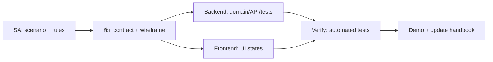

# 10 — Delivery Workflow: จาก Story สู่ Demo

DDD ไม่จบที่ model ที่สวย; ทีมต้องส่งมอบ vertical slice ที่คนร้านใช้และตรวจได้. Kanban card จึงต้องบอก business goal, boundary, acceptance criteria และเจ้าของงานข้าม role—not just “ทำ API” หรือ “ทำหน้า”.

## Story template สำหรับ SA

```text
Title: [actor] ทำ [business outcome] เพื่อ [goal]

Context / trigger:
Command or query:
Aggregate and invariant:
Event / side effect:
API contract and business errors:
UI states:
Acceptance criteria:
Out of scope:
```

## ตัวอย่าง: ส่ง Order เข้าครัว

**Title:** Waiter ส่ง draft order ที่มีรายการเข้าครัว เพื่อให้ทีมครัวเริ่มทำอาหารได้

| Area | ข้อตกลง |
|---|---|
| Command | `SendOrderToKitchen` |
| Aggregate rule | เฉพาะ Draft ที่มีอย่างน้อยหนึ่ง line |
| Event | `OrderSentToKitchen` |
| Side effect | สร้าง `KitchenTicket` ผ่าน Outbox |
| API | `POST /orders/{id}/send-to-kitchen` |
| Errors | `order.empty`, `order.not-draft`, stale version conflict |
| UI | loading, success refresh, business error, kitchen board refresh |
| Done | ticket เห็นบน board และ automated tests ผ่าน |

## Definition of Ready

ก่อน pull story เข้า implementation ต้องตอบได้ครบ:

- actor และ business outcome คืออะไร
- command/query สื่อ intent หรือยัง
- aggregate และ invariant ถูกระบุแล้วหรือยัง
- cross-aggregate side effect มี event หรือยัง
- API/error contract และ wireframe/UI states พอให้ Frontend เริ่มได้หรือยัง
- acceptance criteria ทดสอบได้หรือยัง
- out-of-scope ถูกเขียนเพื่อกัน scope creep หรือยัง

## Definition of Done

Story เสร็จเมื่อ:

- domain behavior และ regression tests ผ่าน
- API contract รวม business error ถูกทดสอบ
- UI state สำคัญใช้งานได้
- migration/reliability impact ถูกระบุ
- handbook decision และ acceptance criteria อัปเดต
- demo ทำ flow ตั้งแต่ trigger ถึง observable outcome ได้

## Workflow ที่แนะนำ



Backend และ Frontend เริ่มคู่กันได้หลัง contract ชัด: Frontend ใช้ mock/read DTO ได้ชั่วคราว แต่ห้ามเปลี่ยน business rule เองเพื่อรอ API. หาก acceptance criterion เปลี่ยนระหว่างทำ ให้กลับไป update Story ก่อน—not silently patch UI or endpoint.

## Checkpoint

หยิบ Story “ส่ง Order เข้าครัว” มาแตก card จริงอย่างน้อย SA, Backend, Frontend และ Test แล้วตรวจว่าแต่ละ card รวมกันยัง demo acceptance criteria เดิมได้. ถ้าต้องอธิบาย rule ด้วยหลาย card โดยไม่มี aggregate owner ชัด แปลว่า story ยังไม่ ready.
