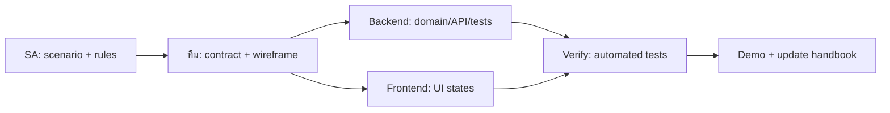

# 10 — Delivery Workflow: จาก Story สู่ Demo

DDD ไม่จบที่ model ที่สวย; ทีมต้องส่งมอบ vertical slice ที่คนร้านใช้และตรวจได้. Kanban card จึงต้องบอก business goal, boundary, acceptance criteria และเจ้าของงานข้าม role ไม่ใช่แค่ “ทำ API” หรือ “ทำหน้า”.

## Story template สำหรับ SA

```text
Title: [actor] ทำ [business outcome] เพื่อ [goal]

Context / trigger:
Business rule IDs / source / decision owner:
Actors / permission questions:
Preconditions / main flow / exception flow:
Command or query:
Aggregate and invariant:
Data source / snapshot policy:
Event / side effect:
API contract and business errors:
UI states:
Recovery / measurable service targets (if in scope):
Acceptance criteria / test references:
UAT owner / evidence:
Open questions / assumptions:
Out of scope:
```

## ตัวอย่าง: ส่ง Order เข้าครัว

**Title:** Waiter ส่ง draft order ที่มีรายการเข้าครัว เพื่อให้ทีมครัวเริ่มทำอาหารได้

| Area | ข้อตกลง |
|---|---|
| Rules | BR-01 และ BR-02 จากบท 01; ผู้ยืนยันในงานจริงต้องระบุใน card |
| Command | `SendOrderToKitchen` |
| Aggregate rule | เฉพาะ Draft ที่มีอย่างน้อยหนึ่ง line |
| Event | `OrderSentToKitchen` |
| Side effect | สร้าง `KitchenTicket` ผ่าน Outbox |
| API | `POST /orders/{id}/send-to-kitchen` |
| Errors | `order.empty`, `order.not-draft`, stale version conflict |
| UI | loading, success refresh, business error, kitchen board refresh |
| Recovery | หลัง commit แล้ว processor ล้ม: message ยัง pending; ผู้ดูแล lab แก้สาเหตุและ process ใหม่ตามบท 08 |
| Done | command ถูกบันทึก และเมื่อ delivery สำเร็จ ticket เห็นบน board; tests และ UAT ตาม scenario ที่ตกลงผ่าน |

`204` เป็นผลของ command ไม่ใช่หลักฐานว่า ticket ปรากฏแล้ว. Story ต้องตรวจทั้ง flow ปกติและ recovery โดยไม่เพิ่มคำสัญญาว่า ticket จะมาภายในเวลาที่ lab ยังไม่ได้รับประกัน. ตัวอย่างนี้ยังไม่รวมระบบสิทธิ์, delivery-status UI, automatic retry หรือ SLA.

## Definition of Ready

ก่อน pull story เข้า implementation ต้องตอบได้ครบ:

- actor และ business outcome คืออะไร
- command/query สื่อ intent หรือยัง
- aggregate และ invariant ถูกระบุแล้วหรือยัง
- cross-aggregate side effect มี event หรือยัง
- API/error contract และ wireframe/UI states พอให้ Frontend เริ่มได้หรือยัง
- acceptance criteria ทดสอบได้หรือยัง
- out-of-scope ถูกเขียนเพื่อกัน scope creep หรือยัง
- แหล่งข้อมูล, snapshot policy, exception/recovery และคำถามเรื่องสิทธิ์มีคำตอบหรือระบุอยู่นอก scope แล้วหรือยัง
- rule มีแหล่งอ้างอิง/ผู้ยืนยัน และระบุผู้ตรวจรับกับหลักฐาน UAT แล้วหรือยัง

คำถามที่เปลี่ยน behavior ของ story ต้องปิดก่อนเริ่ม implementation. คำถามภาคต่อที่ไม่กระทบ MVP เก็บใน question log พร้อมเจ้าของติดตามได้ โดยไม่ถือว่าได้รับการอนุมัติแล้ว.

## Definition of Done

Story เสร็จเมื่อ:

- domain behavior และ regression tests ผ่าน
- API contract รวม business error ถูกทดสอบ
- UI state สำคัญใช้งานได้
- migration/reliability impact ถูกระบุ
- handbook decision และ acceptance criteria อัปเดต
- demo ทำ flow ตั้งแต่ trigger ถึง observable outcome ได้
- ผู้ตรวจรับยืนยัน UAT ตามขอบเขต พร้อมหลักฐานและข้อจำกัดที่ยังเหลือ

## Workflow ที่แนะนำ



Backend และ Frontend เริ่มคู่กันได้หลัง contract ชัด: Frontend ใช้ mock/read DTO ได้ชั่วคราว แต่ห้ามเปลี่ยน business rule เองเพื่อรอ API. หาก acceptance criterion เปลี่ยนระหว่างทำ ให้กลับไป update Story ก่อน ไม่แก้ UI หรือ endpoint เงียบ ๆ.

## Checkpoint

หยิบ Story “ส่ง Order เข้าครัว” มาแตก card จริงอย่างน้อย SA, Backend, Frontend และ Test แล้วตรวจว่าแต่ละ card รวมกันยัง demo acceptance criteria เดิมได้. ถ้าต้องอธิบาย rule ด้วยหลาย card โดยไม่มี aggregate owner ชัด แปลว่า story ยังไม่ ready.

## มุมมอง SA: ประเมิน change impact ก่อนแก้กฎ

**ตัวอย่างภาคต่อ:** ร้านต้องการ modifiers เช่น Pad Thai “ไม่เผ็ด” และ “เผ็ดมาก”. อย่าเพิ่ม field ใน UI ทันที เพราะ BR-03 ปัจจุบันรวม line ด้วย MenuItemId เดียวกัน:

| ส่วนที่กระทบ | คำถาม/สิ่งที่ต้องทบทวน |
|---|---|
| Language และ rule | อะไรทำให้สองรายการถือเป็น line เดียวกัน; ใครยืนยันกฎใหม่ |
| Order aggregate | เงื่อนไขรวม quantity และ identity ของ line เปลี่ยนหรือไม่ |
| Command / API | ส่ง modifier อย่างไร และการลบด้วย MenuItemId ยังระบุ line ได้แน่นอนหรือไม่ |
| Event / Kitchen | snapshot ต้องบอกวิธีปรุงอย่างไร และ consumer อ่าน event เดิมได้หรือไม่ |
| Persistence / read model / UI | เก็บและแสดงหลาย line ของเมนูเดียวกันอย่างไร; order เก่ายังอ่านได้หรือไม่ |
| Tests / UAT | เพิ่มกรณี modifier เหมือน/ต่างกัน และตรวจว่าครัวแยกงานได้ |

**ตัวอย่างผลลัพธ์การวิเคราะห์:** change record ที่เชื่อมคำขอ → BR-03 เดิม → decision ใหม่ → story/contract → tests/UAT ที่กระทบ พร้อมเหตุผล ผู้ยืนยัน และวันที่. เก็บเหตุผลของกฎเดิมไว้เพื่ออธิบายข้อมูลเก่า ไม่เปลี่ยนความหมายย้อนหลังเงียบ ๆ.

**คำถามที่ SA ต้องตอบ:** เปลี่ยนเฉพาะหน้าจอหรือเปลี่ยนความหมายทางธุรกิจ, กระทบ boundary/ผู้ใช้ใดบ้าง และจะพิสูจน์ว่าข้อมูลกับ workflow เดิมยังใช้ได้อย่างไร?
